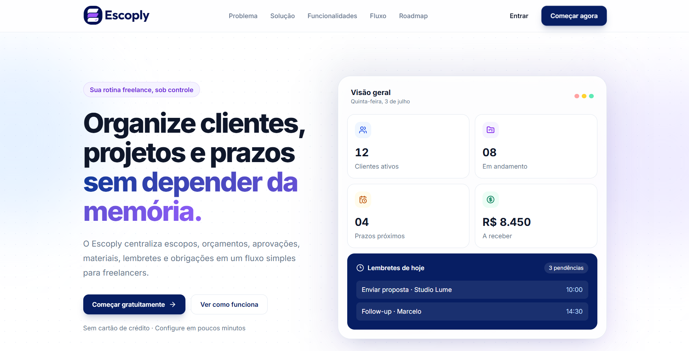
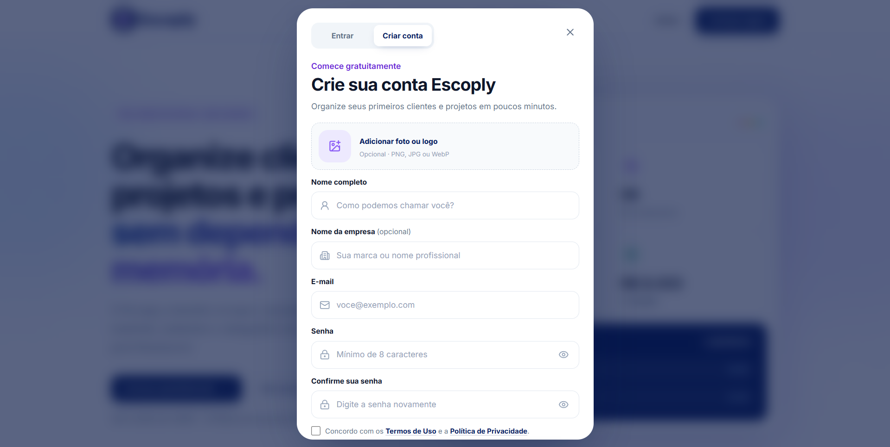
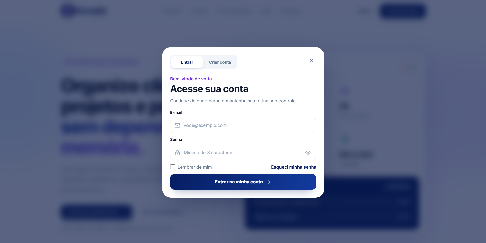

# Escoply Web

> Do briefing à entrega, tudo no controle.

Escoply é uma plataforma para freelancers centralizarem clientes, projetos, escopos, orçamentos, aprovações, materiais, prazos, lembretes e obrigações recorrentes em um só lugar.

O produto transforma informações espalhadas entre WhatsApp, Drive, e-mail, planilhas, anotações e memória em um fluxo simples e rastreável:

**Cliente → Projeto → Escopo → Orçamento → Aprovação → Entrega → Pagamento**

## Visão do produto

O Escoply está sendo construído para oferecer clareza e controle à rotina de profissionais independentes. A interface combina uma identidade SaaS moderna com fluxos objetivos, feedbacks visuais e componentes preparados para evoluir até a futura área autenticada.

## Prévia visual

### Landing page



### Criação de conta



### Acesso à conta



Os arquivos utilizados nesta galeria devem ser adicionados em [`public/screenshots`](./public/screenshots/README.md) com os nomes indicados acima.

## Estado atual

Esta versão contém a base visual do projeto, a landing page institucional responsiva e os fluxos visuais iniciais de login e cadastro.

Já estão implementados:

- landing page institucional completa e responsiva;
- identidade visual oficial, fonte Inter e assets da marca;
- seções de problema, solução, funcionalidades, fluxo e roadmap;
- apresentação preliminar dos planos e FAQ animado;
- mockup de dashboard com indicadores numéricos animados;
- sistema consistente de transições e microinterações;
- modal responsivo de login e criação de conta;
- cadastro com nome, empresa opcional e foto ou logo opcional;
- validação visual de senha forte e confirmação de senha;
- versões preliminares dos Termos de Uso e da Política de Privacidade;
- metadados, favicon e configuração visual do Next.js.

Os formulários representam apenas a interface. Autenticação real, persistência de dados, recuperação de senha e upload ainda não estão conectados a um backend.

## Tecnologias

- [Next.js 16](https://nextjs.org/) com App Router
- [React 19](https://react.dev/)
- [TypeScript](https://www.typescriptlang.org/)
- [Tailwind CSS 4](https://tailwindcss.com/)
- CSS Modules para estilos isolados
- [Lucide React](https://lucide.dev/) para ícones
- [Inter](https://fonts.google.com/specimen/Inter) carregada com `next/font`

## Executando localmente

### Requisitos

- Node.js 20 ou superior
- npm

### Instalação

```bash
git clone <URL_DO_REPOSITORIO>
cd escoply-web
npm install
```

Inicie o servidor de desenvolvimento:

```bash
npm run dev
```

A aplicação estará disponível em [http://localhost:3000](http://localhost:3000).

## Scripts

```bash
npm run dev      # inicia o ambiente de desenvolvimento
npm run build    # gera o build de produção
npm run start    # executa o build de produção
npm run lint     # verifica a qualidade do código
```

Para validar os tipos sem gerar arquivos:

```bash
npx tsc --noEmit
```

## Estrutura do projeto

```text
app/
├── globals.css                  # tema global, tokens e estilos compartilhados
├── layout.tsx                   # layout raiz, fonte e metadados
└── page.tsx                     # composição da landing page

components/
├── landing/                     # seções, header e modal de autenticação
└── ui/                          # componentes visuais reutilizáveis

constants/
├── brand.ts                     # informações e assets da marca
└── landing.ts                   # conteúdo estruturado da página

public/
├── images/                      # logo e ícone oficiais
└── screenshots/                 # capturas utilizadas neste README
```

## Identidade visual

A interface utiliza azul-marinho e roxo como cores principais, com superfícies claras, gradientes sutis, bordas suaves, ícones lineares e tipografia Inter. Os tokens estão definidos como CSS variables em `app/globals.css` para manter consistência entre a landing page e a futura área interna.

O design system prioriza:

- hierarquia visual forte;
- bastante espaço em branco;
- cards arredondados e sombras discretas;
- estados de foco e feedback acessível;
- microinterações suaves;
- componentes responsivos e reutilizáveis.

## Roadmap

As próximas etapas previstas incluem:

- autenticação e recuperação de senha funcionais;
- persistência de perfil e upload de imagem;
- dashboard e área logada;
- gestão de clientes e projetos;
- escopos, orçamentos e aprovações;
- organização de materiais e arquivos;
- prazos, cobranças e obrigações recorrentes;
- experiência mobile;
- camada futura de IA/RAG para consultas e automações contextuais.

Os itens do roadmap representam a direção do produto e ainda não estão disponíveis nesta versão.

## Observação legal

Os Termos de Uso e a Política de Privacidade presentes na interface são textos preliminares. Eles devem passar por revisão jurídica antes do lançamento comercial do produto.

## Autor

Desenvolvido por **Igor Franco**.
