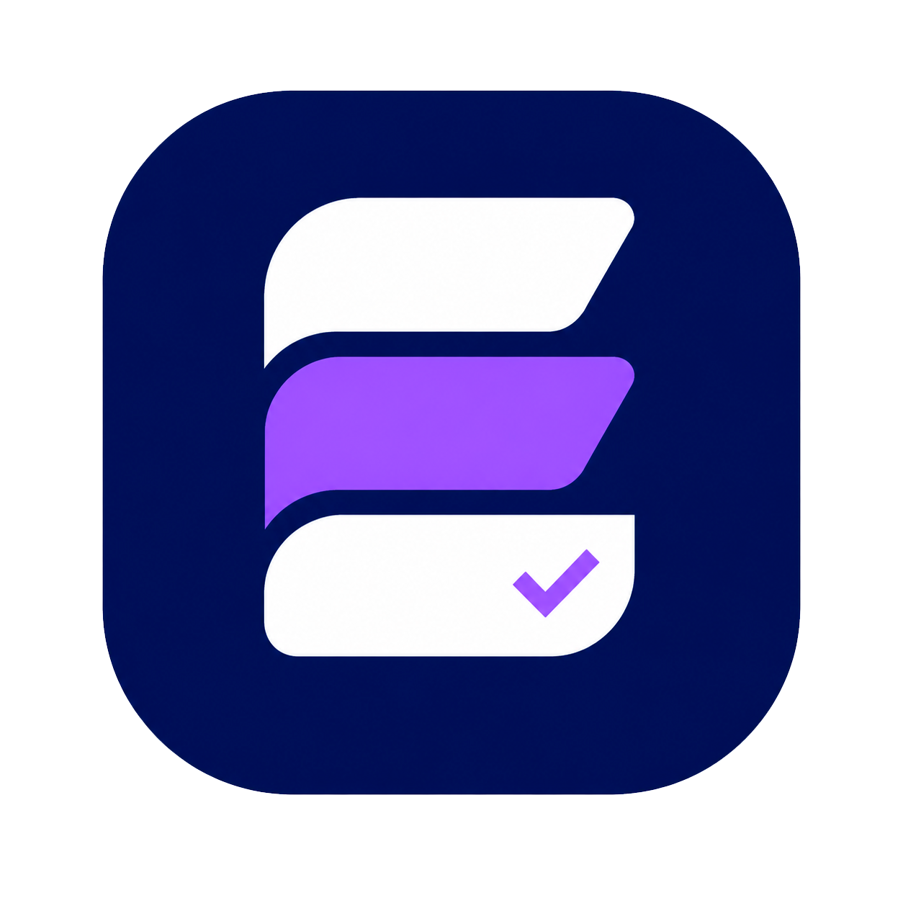
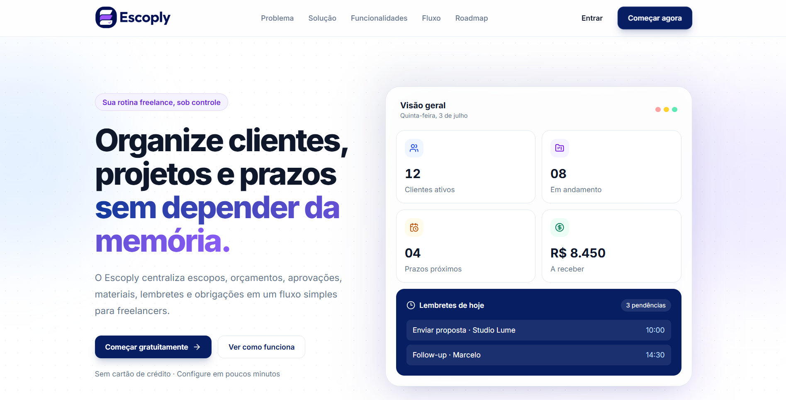
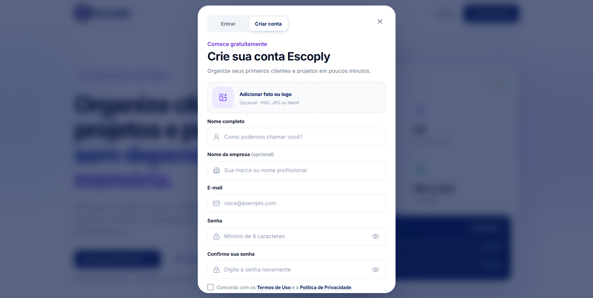

<p align="center">
  
</p>

<h1 align="center">Escoply Web</h1>

<p align="center">
  <strong>Do briefing à entrega, tudo no controle.</strong>
</p>

Escoply Web é uma plataforma SaaS para freelancers centralizarem clientes, projetos, escopos, orçamentos, aprovações, materiais, prazos, agenda, obrigações recorrentes, recebimentos e configurações da conta.

A proposta do produto é resolver uma dor operacional real: informações importantes ficam espalhadas entre WhatsApp, Drive, e-mail, planilhas, anotações e memória. O Escoply organiza essa rotina em um fluxo rastreável:

```text
Cliente → Projeto → Escopo → Orçamento → Aprovação → Entrega → Pagamento
```

## Prévia visual

### Landing page



### Criação de conta



### Login


## Estado atual do projeto

Atualizado em **26/09/2026**. As funcionalidades descritas refletem o código do repositório; não comprovam que a mesma versão esteja publicada na Vercel. Validações e limitações da integração estão no [guia Google](./docs/GOOGLE_INTEGRATION.md).

### Contexto para agentes e colaboradores

A documentação técnica detalhada começa em [`AGENTS.md`](./AGENTS.md) e no [índice de contexto](./docs/agent-context/README.md). Ela cobre produto, funcionalidades e rotas, stack, arquitetura, banco e segurança, UI/UX, componentização, processo de desenvolvimento e limitações conhecidas. Consulte a [matriz de funcionalidades](./docs/agent-context/PRODUCT.md) para distinguir implementação real, demonstração e roadmap, incluindo o painel administrativo.

O projeto já evoluiu além da landing page. A aplicação possui área autenticada, integração com Supabase e módulos internos funcionais para a operação principal do freelancer.

Implementado atualmente:

- landing page institucional responsiva;
- autenticação com Supabase Auth;
- cadastro com foto/avatar opcional;
- login, sessão protegida e recuperação de senha;
- dashboard autenticado com dados reais;
- navegação interna com sidebar e topbar;
- perfil do usuário com avatar, nome, telefone, profissão e bio;
- gestão de clientes com logo, edição, exclusão e detalhes;
- gestão de projetos com criação, edição, exclusão e detalhes completos;
- escopo do projeto com etapas editáveis;
- orçamento vinculado ao projeto e exportação em PDF;
- materiais dentro do detalhe do projeto, separados por arquivos, links e anotações;
- agenda com calendário diário, semanal e mensal, além de Kanban de tarefas;
- troca de período com atualização visual imediata, indicação de carregamento e animação respeitando movimento reduzido;
- criação e edição de compromissos com horário, dia inteiro e lembretes;
- integração Google Agenda e Tasks com OAuth, envio automático local, importação seletiva de histórico e revisão de conflitos;
- exportação opcional de prazos de projetos, validade de orçamentos, recebimentos e obrigações para o Google;
- notificações internas com marcação como lida e limpeza;
- obrigações conectadas ao Supabase, com configuração de recorrência (geração automática de novas ocorrências ainda pendente);
- financeiro conectado ao Supabase, com recebimentos, status, comprovantes e relatórios;
- modais e menus usando portal quando precisam cobrir a tela inteira;
- toasts personalizados para feedbacks de ações;
- migrations SQL e Edge Function centralizadas em `supabase/`.

Ainda não implementado ou em evolução:

- planos/pagamentos reais de assinatura;
- demais integrações externas, como WhatsApp, Google Drive e e-mail;
- importação automática de alterações feitas no Google e geração de ocorrências recorrentes;
- IA/RAG do Escoply;
- app mobile;
- políticas finais de Termos de Uso e Privacidade revisadas juridicamente.

## Agenda e integração Google

Na agenda, o botão **Google Agenda** mostra o estado da conexão: verde para conectado e vermelho para desconectado. Ele abre um modal com conexão, preferências e sincronização do histórico. A configuração também está disponível em **Configurações → Integrações**. No Kanban, **Novo compromisso** e **Nova tarefa** compartilham o grupo de ações.

| Funcionalidade | Comportamento |
| --- | --- |
| Tarefas | Google Tasks recebe título, notas, dia programado e conclusão; a API não sincroniza horário |
| Compromissos | Google Agenda recebe início/fim, dia inteiro e lembretes |
| Novas alterações no Escoply | Após conectar, tarefas e compromissos entram em uma fila de envio automático |
| Histórico anterior à conexão | Prévia por categoria e data, com seleção de concluídos e itens sem data |
| Prazos de negócio | Eventos opcionais de dia inteiro para projetos, orçamentos, recebimentos e obrigações |
| Alterações feitas no Google | Importação manual para tarefas/compromissos; divergências em prazos de negócio exigem revisão |
| Conflitos e exclusões | Revisão explícita para preservar alterações dos dois lados |

O envio automático tenta executar após o salvamento e retoma pendências enquanto o workspace estiver aberto e visível. A fila persiste falhas e protege alterações concorrentes. **Sem um serviço de execução contínua, tentativas pendentes podem aguardar a reabertura do app.** Salvar localmente não depende da disponibilidade do Google.

O período escolhido filtra novos vínculos do histórico; vínculos existentes continuam ativos nas categorias selecionadas. A integração usa a agenda e a lista Escoply, sem importar indiscriminadamente todos os calendários pessoais. Tarefas antigas podem aparecer agrupadas em “Tarefas pendentes” no Google mesmo mantendo suas datas originais.

Eventos derivados de projetos, orçamentos, recebimentos e obrigações **não confirmam pagamento, aprovação ou entrega**. Preferências de categorias e avisos automáticos são persistidas. Obrigações exportam somente ocorrências já cadastradas.

Não há cron, webhook ou serviço adicional pago nesta implementação. O uso precisa permanecer dentro das cotas da infraestrutura e das APIs. Consulte o [guia de ativação e limites](./docs/GOOGLE_INTEGRATION.md) e o [plano de melhorias](./docs/GOOGLE_IMPROVEMENT_PLAN.md).

## Stack

- Next.js 16 com App Router
- React 19
- TypeScript
- Tailwind CSS 4
- CSS Modules e CSS por domínio de tela
- Supabase Auth, Database, Storage e Edge Functions
- Lucide React para ícones
- Inter via `next/font`

## Requisitos

- Node.js 20.9 ou superior (mínimo declarado pela versão instalada do Next.js)
- npm
- Conta/projeto Supabase
- Supabase CLI, quando for aplicar migrations ou functions

## Variáveis de ambiente

Crie um arquivo `.env.local` com as variáveis necessárias ao ambiente. Os campos abaixo são exemplos vazios, não credenciais:

```bash
NEXT_PUBLIC_SUPABASE_URL=
NEXT_PUBLIC_SUPABASE_PUBLISHABLE_KEY=

# Exclusivas do servidor: administração e integração Google
SUPABASE_SECRET_KEY=
GOOGLE_CLIENT_ID=
GOOGLE_CLIENT_SECRET=
GOOGLE_REDIRECT_URI=http://localhost:3000/api/integrations/google/callback
GOOGLE_TOKEN_ENCRYPTION_KEY=
```

Observações:

- `.env` e `.env.local` não devem ser versionados.
- Não coloque `service_role` ou secret keys em variáveis `NEXT_PUBLIC_*`.
- A Edge Function `delete-account` usa secrets próprios no Supabase, não no client.
- `GOOGLE_TOKEN_ENCRYPTION_KEY` deve conter 32 bytes aleatórios em hexadecimal (64 caracteres). Ambientes que compartilham o banco de conexões precisam usar a mesma chave.
- Na Vercel, configure as variáveis do servidor e use o callback HTTPS do domínio publicado. Cadastre o mesmo endereço nos redirecionamentos autorizados do cliente OAuth Web no Google Cloud.
- Ative Google Calendar API e Google Tasks API. Durante os testes OAuth, inclua as contas participantes como usuários de teste.
- O acesso privilegiado do Supabase e os tokens Google permanecem no servidor. A integração exige suas migrations; apenas cadastrar variáveis não a ativa por completo.

## Executando localmente

Instale as dependências:

```bash
npm install
```

Inicie o ambiente de desenvolvimento:

```bash
npm run dev
```

A aplicação fica disponível em:

```text
http://localhost:3000
```

## Scripts

```bash
npm run dev      # inicia o servidor de desenvolvimento
npm run build    # gera o build de produção
npm run start    # executa o build de produção
npm run lint     # executa ESLint
npm run test:google # testa sincronização, datas, conflitos, projeções e fila com serviços simulados
```

Validação de TypeScript:

```bash
npx tsc --noEmit
```

No Windows/PowerShell, se `npx` for bloqueado por Execution Policy, use:

```bash
npx.cmd tsc --noEmit
```

## Rotas principais

| Rota | Descrição |
| --- | --- |
| `/` | Landing page institucional |
| `/auth/callback` | Callback de autenticação Supabase |
| `/auth/reset-password` | Redefinição de senha |
| `/api/integrations/google/callback` | Retorno OAuth Google, separado do login Supabase |
| `/dashboard` | Dashboard principal autenticado |
| `/dashboard/clientes` | Gestão de clientes |
| `/dashboard/projetos` | Lista e gestão de projetos |
| `/dashboard/projetos/[projectId]` | Detalhe completo do projeto |
| `/dashboard/agenda` | Calendário e Kanban de tarefas |
| `/dashboard/tarefas` | Redirecionamento para a agenda; lógica de tarefas permanece nesse domínio |
| `/dashboard/obrigacoes` | Obrigações recorrentes |
| `/dashboard/financeiro` | Recebimentos, cobranças e relatórios |
| `/dashboard/configuracoes` | Configurações da conta |
| `/finance` | Redirecionamento/compatibilidade para financeiro |
| `/obligations` | Redirecionamento/compatibilidade para obrigações |
| `/settings` | Redirecionamento/compatibilidade para configurações |

## Estrutura do projeto

```text
app/
├── api/integrations/google/       # callback OAuth Google
├── auth/                         # callback e recuperação de senha
├── dashboard/                    # área autenticada
│   ├── agenda/
│   ├── clientes/
│   ├── configuracoes/
│   ├── financeiro/
│   ├── obrigacoes/
│   ├── projetos/
│   └── tarefas/                  # rota legada/compatibilidade
├── finance/                      # rota de compatibilidade
├── obligations/                  # rota de compatibilidade
├── settings/                     # rota de compatibilidade
├── globals.css
├── layout.tsx
└── page.tsx

components/
├── google/                       # modal, conexão, prévias, compromissos e retomada automática
├── auth/                         # formulários de autenticação
├── dashboard/                    # dashboard, shell, clientes, projetos, agenda
├── finance/                      # financeiro, recebimentos e relatórios
├── landing/                      # landing page e modal de auth
├── obligations/                  # obrigações recorrentes
├── settings/                     # configurações da conta
└── ui/                           # componentes utilitários compartilhados

lib/
├── google/                       # OAuth, criptografia, sincronização, projeções e fila
├── agenda/
├── auth/
├── clients/
├── dashboard/
├── finance/
├── obligations/
├── projects/
└── supabase/

supabase/
├── migrations/                   # schema, RLS, Storage e evolução do banco
├── functions/                    # Edge Functions
├── config.toml
├── README.md
└── seed.sql

public/
├── images/                       # logo e ícone oficiais
└── screenshots/                  # imagens usadas neste README

tests/
└── google-integration.test.mjs    # testes comportamentais sem credenciais ou rede
```

## Supabase

A pasta `supabase/` centraliza a infraestrutura do backend:

- migrations SQL;
- políticas de RLS;
- buckets de Storage;
- Edge Functions;
- seed inicial.

Principais domínios já modelados:

- `profiles`;
- `clients`;
- `projects`;
- escopos/etapas;
- budgets/orçamentos;
- materials/materiais;
- payments/recebimentos;
- obligations/obrigações;
- `reminders` (tarefas) e `calendar_events` (compromissos);
- conexões Google, estados OAuth, vínculos de sincronização e fila `google_outbox`;
- notifications.

Antes de aplicar migrations, confirme a conta e o projeto vinculado e revise exatamente o que será enviado:

```bash
npx supabase projects list
npx supabase migration list
npx supabase db push --dry-run
```

Para aplicar as migrations revisadas no projeto remoto:

```bash
npx supabase db push
```

Para listar o estado local/remoto:

```bash
npx supabase migration list
```

Para publicar a Edge Function de exclusão de conta:

```bash
npx supabase functions deploy delete-account
```

Detalhes específicos ficam em [`supabase/README.md`](./supabase/README.md).

A integração Google usa as migrations `202609250001_google_calendar_tasks.sql`, `202609250002_google_business_projections.sql` e `202609260001_google_automatic_queue.sql`, após as migrations anteriores. Elas foram aplicadas no ambiente de desenvolvimento Escoply; novos ambientes precisam executar sua própria configuração.

## Autenticação e segurança

A área `/dashboard` é protegida por sessão Supabase. O helper `requireUser()` redireciona usuários não autenticados para a landing page com modal de login.

Pontos atuais:

- Auth via Supabase;
- cookies de sessão via `@supabase/ssr`;
- modo “lembrar de mim” com persistência controlada;
- RLS nas tabelas principais;
- Storage privado para avatares, logos de clientes, materiais e comprovantes;
- exclusão de conta via Edge Function com service role isolada no backend.
- OAuth Google com state de uso único, PKCE e refresh tokens criptografados por proprietário;
- tabelas de credenciais, vínculos e fila Google restritas ao servidor, com autenticação e validação de conta ativa nas operações.

## Design system

A identidade visual usa azul-marinho e roxo como base:

```text
Primary:        #071E63
Primary Dark:   #041342
Primary Light:  #123A9C
Secondary:      #8B5CF6
Secondary Dark: #6D28D9
Secondary Light:#A78BFA
Background:     #F8FAFC
Surface:        #FFFFFF
Border:         #E2E8F0
Text:           #0F172A
Text Muted:     #64748B
```

O padrão visual do produto prioriza:

- cards brancos com bordas suaves;
- sombras discretas;
- bastante espaçamento;
- tipografia Inter;
- ícones lineares;
- modais com overlay global;
- feedback por toast;
- responsividade mobile-first.

## Convenções técnicas

- Usar TypeScript sem `any`.
- Preferir Server Components para leitura inicial de dados.
- Usar Server Actions para mutações simples.
- Uploads maiores devem ir direto para Supabase Storage pelo client.
- Manter migrations novas em arquivos novos; não alterar migrations já aplicadas em produção.
- Não versionar `.env`, `.next`, `node_modules` ou `supabase/.temp`.
- Manter materiais dentro do detalhe do projeto, não como página principal.

## Validação antes de commit

Antes de subir alterações relevantes:

```bash
npm run lint
npx tsc --noEmit
npm run test:google
```

Quando houver alteração de schema, confira o projeto e revise o dry-run antes da aplicação autorizada:

```bash
npx supabase migration list
npx supabase db push --dry-run
```

## Roadmap

Próximas frentes prováveis:

- evoluir configurações profissionais e preferências de notificações já persistidas;
- completar integrações externas;
- evoluir importação Google, recorrência e lembretes vinculados a escopo, aprovação e materiais;
- melhorar permissões e auditoria;
- criar templates finais de e-mail;
- evoluir relatórios financeiros;
- adicionar camada futura de IA/RAG;
- preparar deploy de produção.

## Observação legal

Os textos de Termos de Uso e Política de Privacidade presentes na interface são preliminares. Antes de lançamento comercial, devem passar por revisão jurídica.

## Autor

Desenvolvido por **Igor Franco**.
